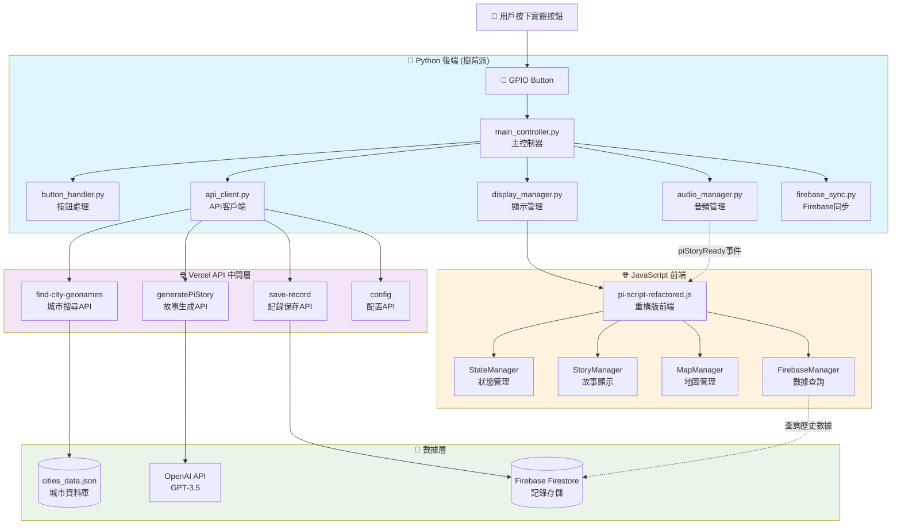

# 🏗️ API架構與系統關係分析

## 📊 **系統整體架構圖**



## 🔗 **詳細關係分析**

### **1. main_controller.py (Python 主控制器)**

#### **核心職責**
- 🎯 統一協調所有模組的主控檔案
- 🔄 管理完整的甦醒流程
- ⚡ 異步事件處理和模組通訊

#### **與API的關係**
```python
# main_controller.py 通過 api_client.py 調用 API
async def start_wakeup_process(self):
    # 1. 調用城市搜尋API
    city_data = await self.api_client.find_city()
    
    # 2. 生成並播放語音問候（背景執行）
    audio_task = asyncio.create_task(
        self.audio_manager.generate_and_play_greeting(city_data)
    )
    
    # 3. 同步資料到Firebase（背景執行）
    firebase_task = asyncio.create_task(
        self.firebase_sync.save_record(city_data)
    )
    
    # 4. 觸發JavaScript前端流程
    await self.display_manager.show_result(city_data)
```

#### **與 pi-script-refactored.js 的關係**
```python
# display_manager.py 中觸發 JavaScript
async def _trigger_wakeup_process(self, city_data):
    # 設定城市資料到 window 物件
    js_set_data = f"""
    window.currentCityData = {json.dumps(city_data)};
    """
    await self.execute_js(js_set_data)
    
    # 觸發 displayAwakeningResult
    js_trigger = f"""
    if (window.displayAwakeningResult) {{
        window.displayAwakeningResult(window.currentCityData);
    }}
    """
    await self.execute_js(js_trigger)
```

---

### **2. API 資料夾架構分析**

#### **🌍 find-city-geonames/index.js (城市搜尋核心)**

**功能**: 根據時間計算目標緯度，搜尋符合條件的城市

**調用關係**:
```javascript
// pi-script-refactored.js 中調用
static async _findCity(targetData) {
    const response = await fetch('/api/find-city-geonames', {
        method: 'POST',
        headers: { 'Content-Type': 'application/json' },
        body: JSON.stringify({
            targetLatitude: targetData.latitude,
            targetUTCOffset: 8
        })
    });
}
```

**數據來源**: `cities_data.json` (本地城市資料庫)

**算法邏輯**:
1. 時間 → 目標緯度轉換: `70 - (minutes * 140 / 59)`
2. 經度範圍搜尋: ±7°, ±15°, ±30°, ±45° (漸進式擴大)
3. 緯度過濾和距離計算
4. 隨機選擇或根據訪問統計選擇

#### **📖 generatePiStory/index.js (故事生成)**

**功能**: 使用OpenAI GPT-3.5生成本地化故事和問候語

**調用關係**:
```javascript
// StoryManager 中調用
static async _generateViaAPI(cityData) {
    const response = await fetch('/api/generatePiStory', {
        method: 'POST',
        headers: { 'Content-Type': 'application/json' },
        body: JSON.stringify({
            city: cityData.city || cityData.name,
            country: cityData.country
        })
    });
}
```

**生成內容**:
1. **問候語**: 當地語言的"早安"
2. **故事內容**: 50字以內的創意故事
3. **語言信息**: 語言名稱和ISO代碼

**與Python後端關係**:
- Python `audio_manager.py` 可能調用同樣的API生成TTS內容
- 生成的故事通過 `piStoryReady` 事件傳遞給前端

#### **💾 save-record/index.js (記錄保存)**

**功能**: 將甦醒記錄保存到Firebase的多個collection

**調用關係**:
```javascript
// pi-script-refactored.js 中可能被調用（備援）
// 主要由 Python firebase_sync.py 間接調用
```

**存儲結構**:
```javascript
// 雙重存儲：新架構 + 舊架構兼容
artifacts/${APP_ID}/userProfiles/${sanitizedDisplayName}/clockHistory  // 新架構
artifacts/${APP_ID}/publicData/allSharedEntries/dailyRecords           // 公共數據
userHistory                                                             // 舊架構(兼容)
globalDailyRecords                                                      // 舊架構(兼容)
```

---

### **3. pi-script-refactored.js (JavaScript 前端)**

#### **與API的直接調用關係**

```javascript
class WakeUpManager {
    // 🌍 調用城市搜尋API
    static async _findCity(targetData) {
        const response = await fetch('/api/find-city-geonames', {/*...*/});
    }
}

class StoryManager {
    // 📖 調用故事生成API
    static async _generateViaAPI(cityData) {
        const response = await fetch('/api/generatePiStory', {/*...*/});
    }
}

class FirebaseManager {
    // 💾 查詢Firebase數據（直接連接，不通過API）
    static async queryUserRecords() {
        const querySnapshot = await getDocs(q);
    }
}
```

#### **與main_controller.py的協作關係**

```javascript
// 接收Python後端設定的全域變數
window.currentCityData = cityData;  // Python設定
window.rawUserDisplayName = "future";

// 接收Python後端觸發的事件
window.addEventListener('piStoryReady', (event) => {
    // Python audio_manager 完成語音生成後觸發
    window.voiceStoryDisplayed = true;
    StoryManager._displayWithTyping(event.detail.story);
});

// 提供給Python後端調用的函數
window.displayAwakeningResult = async function(cityData) {
    await WakeUpManager._displayResults(cityData);
};
```

---

## 🔄 **完整數據流程**

### **階段1: 初始化 (頁面載入時)**
```
pi-script-refactored.js
├── FirebaseManager.queryUserRecords('userHistory') 
│   └── 查詢歷史軌跡數據
├── MapManager.initMap() 
│   └── 初始化地圖顯示歷史軌跡
└── StateManager.setState('waiting')
    └── 顯示 "press the button" 頁面
```

### **階段2: 按鈕觸發流程**
```
User按鈕 → main_controller.py → API調用鏈 → JavaScript顯示

具體流程:
1. 🔘 GPIO按鈕 → ButtonHandler → main_controller.py
2. 🌍 main_controller → api_client → /api/find-city-geonames
3. 📖 audio_manager → /api/generatePiStory (生成語音故事)
4. 💾 firebase_sync → /api/save-record (保存記錄)
5. 🖥️ display_manager → pi-script-refactored.js (觸發前端)
6. 🎵 audio_manager → piStoryReady事件 → JavaScript
```

### **階段3: 數據存儲和查詢**
```
數據寫入: Python → API → Firebase
├── firebase_sync.py → /api/save-record → Firestore
│   ├── artifacts/...userProfiles/.../clockHistory (新架構)
│   ├── artifacts/...publicData/.../dailyRecords (公共數據)
│   ├── userHistory (舊架構兼容)
│   └── globalDailyRecords (舊架構兼容)

數據讀取: JavaScript → Firebase (直接連接)
└── FirebaseManager.queryUserRecords() → Firestore
    ├── userHistory (歷史軌跡)
    └── wakeup_records (備援查詢)
```

---

## 💡 **關鍵設計模式**

### **1. 分層架構**
- **前端層**: JavaScript (UI/UX)
- **控制層**: Python (業務邏輯)  
- **API層**: Vercel (服務接口)
- **數據層**: Firebase + JSON (持久化)

### **2. 異步協作**
```python
# Python 端: 異步處理，非阻塞
audio_task = asyncio.create_task(audio_manager.generate_greeting())
firebase_task = asyncio.create_task(firebase_sync.save_record())
await display_manager.trigger_frontend()  # 立即觸發前端
```

```javascript
// JavaScript 端: 事件驅動
window.addEventListener('piStoryReady', handler);  // 被動接收
setTimeout(() => fallbackAPI(), 5000);            // 主動備援
```

### **3. 多重備援機制**
- **故事顯示**: 語音生成 → API生成 → 本地備援
- **數據存儲**: 新架構 + 舊架構兼容
- **Firebase連接**: Python寫入 + JavaScript讀取

### **4. 統一配置管理**
```python
# Python: config.py 統一配置
TTS_CONFIG = { 'openai_api_key': '...', 'volume': 95 }
FIREBASE_CONFIG = { 'project_id': '...', 'client_email': '...' }
```

```javascript
// JavaScript: ConfigManager 類統一管理
class ConfigManager {
    static getMapConfig(type) { /* 地圖配置 */ }
    static getMarkerStyle(type) { /* 標記樣式 */ }
}
```

---

## 🎯 **總結**

這個系統實現了**三層協作架構**:

1. **🐍 Python後端**: 硬體控制、業務邏輯、音頻處理
2. **🌐 API中間層**: 無狀態服務、數據處理、第三方集成  
3. **🖥️ JavaScript前端**: 用戶界面、視覺效果、地圖操作

**main_controller.py** 作為協調中心，通過模組化設計統一管理所有功能，並與API層和前端層實現清晰的職責分工。**pi-script-refactored.js** 專注於用戶界面和視覺體驗，通過事件機制與Python後端協作。

這種架構既保持了各層的獨立性，又實現了有效的協作，為系統的維護和擴展提供了良好的基礎。🚀