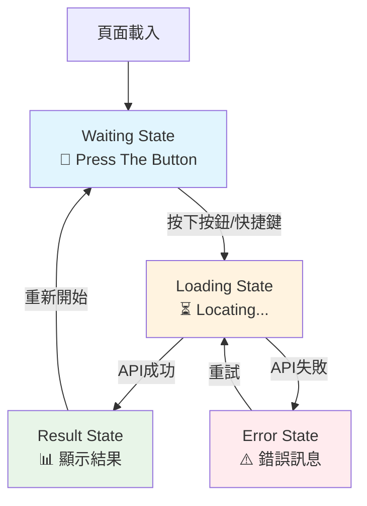

# 🖥️ pi.html 介面結構完整分析

## 📋 **總覽**

`pi.html` 採用**狀態機設計模式**，包含4個主要狀態頁面和1個背景地圖層，通過 CSS 類控制顯示/隱藏。

---

## 🎯 **主要介面狀態**

### **1. 🔘 Press The Button 頁面 (等待狀態)**

**HTML結構**: `#waitingState`
```html
<div id="waitingState" class="state waiting-state active">
    <div class="waiting-content-box">
        <h1 class="press-button-title blinking-text">PRESS THE BUTTON</h1>
        <p class="press-button-subtitle">TO LOCATE YOUR WAKEUP LOCATION</p>
        <p class="press-button-chinese">按下按鈕，定位你今日的甦醒位置</p>
        
        <!-- 隱藏緊急按鈕 -->
        <div id="hiddenBackupButton" onclick="window.startTheDay && window.startTheDay()">
            🆘
        </div>
    </div>
</div>
```

**特色功能**:
- ✨ **閃爍標題**: `blinking-text` CSS 動畫
- 🆘 **緊急備用按鈕**: 左上角幾乎透明的圓形按鈕
- ⌨️ **快捷鍵支援**: `Ctrl + H` 觸發，`ESC` 顯示緊急按鈕

**狀態控制**: `class="active"` 顯示此頁面

---

### **2. ⏳ Locating 頁面 (載入狀態)**

**HTML結構**: `#loadingState`
```html
<div id="loadingState" class="state loading-state">
    <div class="loading-content-box">
        <h1 class="locating-title blinking-text">LOCATING...</h1>
        <p class="locating-progress">正在為你定位今日的甦醒位置......</p>
        <p class="locating-subtitle">按下按鈕，定位你今日的甦醒位置</p>
    </div>
</div>
```

**特色功能**:
- ✨ **閃爍動畫**: "LOCATING..." 標題閃爍效果
- 📱 **進度提示**: 中文說明正在進行的動作
- 🎯 **中央定位**: 內容框居中顯示

**觸發時機**: 按下按鈕後，JavaScript 設置 `active` 類

---

### **3. 📊 Result 頁面 (結果狀態)**

**HTML結構**: `#resultState`
```html
<div id="resultState" class="state result-state">
    <!-- 左側信息面板 (浮層) -->
    <div class="result-info-panel">
        <!-- 日期信息 -->
        <div class="date-info">
            <span class="date-label">Date:</span>
            <span id="wakeupDate" class="date-value">07/25/2025 Fri</span>
        </div>
        
        <!-- 問候語信息 -->
        <div class="greeting-info">
            <span id="localGreeting" class="local-greeting">GOOD MORNING! (English)</span>
        </div>
        
        <!-- 地點信息 -->
        <div class="location-info">
            <h1 id="cityName" class="city-name">LOGAN</h1>
            <div class="country-info">
                
                <span id="countryName" class="country-name">United States</span>
            </div>
            <!-- 座標信息 -->
            <div class="coordinates-info">
                <span id="coordinates" class="coordinates-text">21.276, 55.517</span>
            </div>
        </div>
        
        <!-- 故事文字容器 -->
        <div class="story-container">
            <p id="storyText" class="story-text"></p>
        </div>
    </div>
</div>
```

**信息面板組成**:
- 📅 **日期顯示**: 當前日期格式化顯示
- 🌍 **當地問候語**: 當地語言的早安問候
- 🏙️ **城市名稱**: 大標題顯示城市名 + 冒號
- 🏳️ **國旗 + 國家**: 國旗圖片 + 國家名稱
- 📍 **座標信息**: 精確的經緯度座標
- 📖 **故事內容**: 打字機效果顯示的創意故事

**布局特色**:
- 📱 **浮層設計**: 左側信息面板浮在地圖上方
- 🎨 **像素字體**: 支援中英文像素風格字體
- 📏 **響應式**: 自適應不同屏幕尺寸

---

### **4. ⚠️ Error 頁面 (錯誤狀態)**

**HTML結構**: `#errorState`
```html
<div id="errorState" class="error-state">
    <div class="error-content">
        <div class="error-icon">⚠️</div>
        <h2 class="error-text">暫時無法連接</h2>
        <p id="errorMessage" class="error-subtitle">請稍候再試</p>
    </div>
</div>
```

**觸發場景**: API調用失敗、網路連接問題等

---

## 🗺️ **背景地圖層**

### **全域地圖容器**

**HTML結構**: `#mainMapContainer`
```html
<div id="mainMapContainer" class="main-map-background"></div>

<!-- 地圖縮放控制 -->
<div class="map-zoom-controls">
    <button id="zoomInButton" class="zoom-button" title="放大">+</button>
    <button id="zoomOutButton" class="zoom-button" title="縮小">-</button>
</div>
```

**功能特色**:
- 🌍 **全螢幕地圖**: 作為所有狀態的背景
- 🔍 **縮放控制**: 右側固定位置的 +/- 按鈕
- 📍 **軌跡顯示**: 顯示歷史軌跡和今日位置標記
- 🎯 **動態定位**: 根據城市資料自動定位地圖中心

---

## 🔧 **隱藏/相容性元素**

### **相容性保持區域**
```html
<div style="display: none;">
    <!-- 用戶信息 -->
    <input type="hidden" id="groupName" value="">
    <input type="hidden" id="userName" value="future">
    
    <!-- 虛擬按鈕 (供 JavaScript 相容) -->
    <button id="setUserNameButton" class="load-button">載入資料</button>
    <button id="findCityButton" class="start-button">開始這一天</button>
    
    <!-- 調試信息容器 -->
    <div id="resultText" class="result-text"></div>
    <div id="debugInfo" class="debug-info"></div>
    <div id="debugInfoSmall" class="debug-info-small"></div>
    
    <!-- 歷史記錄相關 -->
    <ul id="historyList"></ul>
    <div id="historyMapContainer"></div>
    <div id="historyDebugInfo"></div>
</div>
```

**用途**: 保持與舊版 JavaScript 代碼的相容性

---

## 🎭 **狀態轉換邏輯**

### **CSS 狀態控制機制**

所有狀態頁面都有 `.state` 基類，通過添加/移除 `.active` 類控制顯示：

```css
.state {
    display: none; /* 預設隱藏 */
}

.state.active {
    display: flex; /* 啟用時顯示 */
}
```

### **JavaScript 狀態管理**

```javascript
// 狀態轉換函數 (在 pi-script-refactored.js 中)
class StateManager {
    static setState(newState) {
        // 隱藏所有狀態
        document.querySelectorAll('.state').forEach(state => {
            state.classList.remove('active');
        });
        
        // 顯示指定狀態
        const targetState = document.getElementById(newState + 'State');
        if (targetState) {
            targetState.classList.add('active');
        }
    }
}

// 狀態流程
// waiting → loading → result → (error if needed)
```

---

## 🎨 **視覺設計特色**

### **像素風格字體系統**

```css
.pixel-font-en {
    font-family: 'ByteBounce', 'Press Start 2P', 'Courier New', monospace;
}

.pixel-font-cn {
    font-family: 'GB18030 Bitmap', 'Microsoft YaHei', '微軟雅黑', SimHei, '黑體', sans-serif;
}

.pixel-font-mixed {
    font-family: 'ByteBounce', 'GB18030 Bitmap', 'Press Start 2P', 'Microsoft YaHei', '微軟雅黑', monospace;
}
```

### **動畫效果**

- ✨ **閃爍動畫**: `.blinking-text` 用於標題強調
- 🎭 **淡入淡出**: 狀態切換時的過渡效果
- ⏰ **打字機效果**: 故事文字逐字顯示

### **響應式布局**

- 📱 **固定尺寸**: `width=800` 針對樹莓派螢幕優化
- 🎯 **中央對齊**: 各狀態內容框居中顯示
- 📏 **浮層設計**: Result 頁面信息面板浮在地圖上

---

## 🔧 **開發者功能**

### **隱藏調試按鈕**

```javascript
// 控制台指令
hiddenButtonControl.show()    // 顯示隱藏按鈕
hiddenButtonControl.hide()    // 隱藏按鈕  
hiddenButtonControl.trigger() // 觸發按鈕功能
hiddenButtonControl.help()    // 顯示幫助信息

// 快捷鍵
Ctrl + H                      // 直接觸發 startTheDay()
ESC                          // 臨時顯示緊急按鈕 5 秒
```

### **地圖初始化保護**

```javascript
// 防止重複初始化
if (window.mainInteractiveMap) {
    console.log('🗺️ 地圖已經初始化，跳過重複初始化');
    return;
}

// 容器清理機制
if (mapContainer._leaflet_id) {
    mapContainer._leaflet_id = null;
    mapContainer.innerHTML = '';
}
```

---

## 📊 **狀態流程圖**



---

## 🎯 **總結**

`pi.html` 採用現代化的單頁應用程式設計：

### **優勢**
- 🎯 **狀態清晰**: 四個主要狀態，職責分明
- 🎨 **視覺統一**: 像素風格主題一致
- 🔧 **易於維護**: 模組化CSS，JavaScript狀態管理
- 📱 **樹莓派優化**: 固定解析度，觸控友好
- 🆘 **調試友善**: 多種隱藏功能和快捷鍵

### **核心流程**
1. **Waiting** → 等待用戶按下實體按鈕
2. **Loading** → 後端處理城市搜尋和語音生成  
3. **Result** → 顯示城市資訊、地圖軌跡、創意故事

這個設計為樹莓派提供了完整的沉浸式甦醒體驗界面！🚀✨