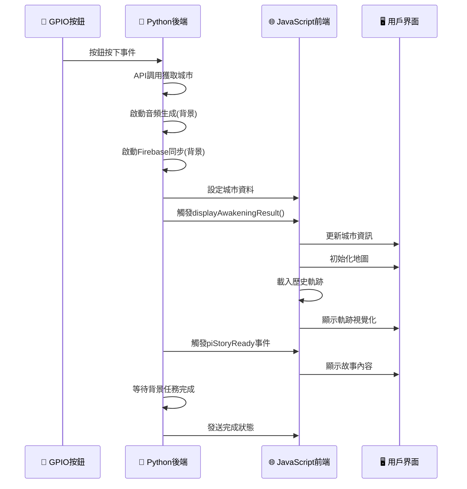

# Python + JavaScript 整合架構

## 🔗 整合設計理念

將樹莓派系統分為兩層：
- **Python 後端**：硬體控制、API調用、音頻處理
- **JavaScript 前端**：UI顯示、地圖視覺化、軌跡繪製

## 🏗️ 整合架構圖

```
┌─────────────────┐    ┌─────────────────┐
│   Python 後端    │    │ JavaScript 前端  │
├─────────────────┤    ├─────────────────┤
│ 🔘 GPIO 按鈕     │ ──▶│ 🖥️ 狀態切換      │
│ 🌍 API 調用      │ ──▶│ 🗺️ 地圖顯示      │
│ 🔊 音頻生成      │ ──▶│ 📊 軌跡視覺化    │
│ 🔥 Firebase 同步 │ ──▶│ 🎨 UI 動畫       │
│ ⚙️ 配置管理      │ ──▶│ 📖 故事顯示      │
└─────────────────┘    └─────────────────┘
```

## 🔄 完整流程示例

### 1. 用戶按下實體按鈕
```python
# Python: button_handler.py
GPIO.add_event_detect(18, GPIO.BOTH, callback=self._gpio_callback)
```

### 2. Python 處理後端邏輯
```python
# Python: main_controller.py
async def start_wakeup_process(self):
    # 🌍 API 調用
    city_data = await self.api_client.find_city()
    
    # 🔊 音頻生成（背景）
    audio_task = asyncio.create_task(
        self.audio_manager.generate_and_play_greeting(city_data)
    )
    
    # 🔥 Firebase 同步（背景）
    firebase_task = asyncio.create_task(
        self.firebase_sync.save_record(city_data)
    )
```

### 3. 觸發 JavaScript 前端處理
```python
# Python: display_manager.py
await self.execute_js(f"""
    window.currentCityData = {json.dumps(city_data)};
    displayAwakeningResult(window.currentCityData);
""")
```

### 4. JavaScript 接管 UI 和視覺化
```javascript
// JavaScript: pi-script.js
async function displayAwakeningResult(cityData) {
    // 🖥️ 更新城市資訊
    updateCityDisplay(cityData);
    
    // 🗺️ 初始化地圖
    initClockMap(cityData.latitude, cityData.longitude);
    
    // 📊 載入軌跡（v4.0.0 功能）
    await loadHistoryTrajectory();
    
    // 🎨 顯示結果頁面
    setState('result');
}
```

### 5. 故事生成和顯示
```python
# Python: 生成故事後觸發事件
await self.display_manager.execute_js(f"""
    const event = new CustomEvent('piStoryReady', {{
        detail: {json.dumps(story_data)}
    }});
    window.dispatchEvent(event);
""")
```

```javascript
// JavaScript: 接收故事事件
window.addEventListener('piStoryReady', (event) => {
    const storyData = event.detail;
    startStoryTypewriter(storyData.story);
    // 觸發完整的 v4.0.0 軌跡系統
});
```

## 📁 檔案職責分工

### Python 模組職責
```
modules/
├── button_handler.py     # 🔘 GPIO 按鈕事件處理
├── audio_manager.py      # 🔊 TTS 語音生成和播放
├── api_client.py        # 🌍 後端 API 調用
├── firebase_sync.py     # 🔥 Firebase 資料同步
├── display_manager.py   # 🔗 JavaScript 事件觸發
└── config_manager.py    # ⚙️ 統一配置管理
```

### JavaScript 職責
```
pi-script.js
├── displayAwakeningResult()   # 🎨 結果頁面顯示
├── loadHistoryTrajectory()    # 📊 軌跡視覺化 (v4.0.0)
├── displayHistoryTrajectory() # 🗺️ 地圖標記和線條
├── startStoryTypewriter()     # 📖 故事打字機效果
└── setState()                 # 🖥️ 頁面狀態管理
```

## 🚀 使用方法

### 1. 啟動整合系統
```bash
# 標準模組化版本
python3 run_modular.py

# 整合示例版本
python3 integration_example.py
```

### 2. 配置設定
```python
# config.py
TTS_CONFIG = {
    'nova_integrated_mode': False,  # 設為 True 啟用 Nova 整合
    'engine': 'festival'            # 預設使用 Festival
}

SCREEN_CONFIG = {
    'fullscreen': True,             # 全螢幕模式
    'width': 800,
    'height': 480
}
```

### 3. 調試模式
```python
# 檢查 JavaScript 函數是否存在
await display_manager.execute_js("""
    console.log('可用函數:', Object.keys(window).filter(k => typeof window[k] === 'function'));
""")

# 檢查 v4.0.0 功能
await display_manager.execute_js("""
    console.log('軌跡功能:', typeof loadHistoryTrajectory);
    console.log('地圖狀態:', !!window.mainInteractiveMap);
""")
```

## 🔧 整合優點

### ✅ 充分利用現有功能
- **保留 v4.0.0 軌跡視覺化**：完整的地圖標記和軌跡線
- **保留語音故事保護**：防止內容覆蓋的機制
- **保留 Firebase 雙重保險**：自動初始化和同步

### ✅ 模組化架構優勢
- **清晰分工**：Python 處理硬體，JavaScript 處理 UI
- **異步處理**：音頻和 Firebase 背景執行，UI 立即響應
- **錯誤隔離**：模組獨立，單一故障不影響整體

### ✅ 開發和維護友好
- **獨立測試**：Python 模組和 JavaScript 功能可單獨測試
- **漸進升級**：可以逐步替換或增強個別模組
- **完整日誌**：Python 和 JavaScript 雙重日誌記錄

## 🔄 事件流程圖



## 🎯 最佳實踐

### 1. 事件同步
```python
# 確保 JavaScript 準備好再發送事件
await asyncio.sleep(1)
await display_manager.trigger_pi_story_ready(story_data)
```

### 2. 錯誤處理
```python
# Python 錯誤處理
try:
    await display_manager.execute_js(js_code)
except Exception as e:
    logger.error(f"JavaScript 執行失敗: {e}")
    # 降級處理
```

### 3. 狀態同步
```javascript
// JavaScript 狀態回報
window.reportStatusToPython = function(status) {
    console.log('狀態回報:', status);
    // 可以通過 webview API 回報給 Python
};
```

---

**這個整合架構讓樹莓派系統既保留了 v4.0.0 的完整功能，又獲得了模組化的架構優勢！** 🎉✨